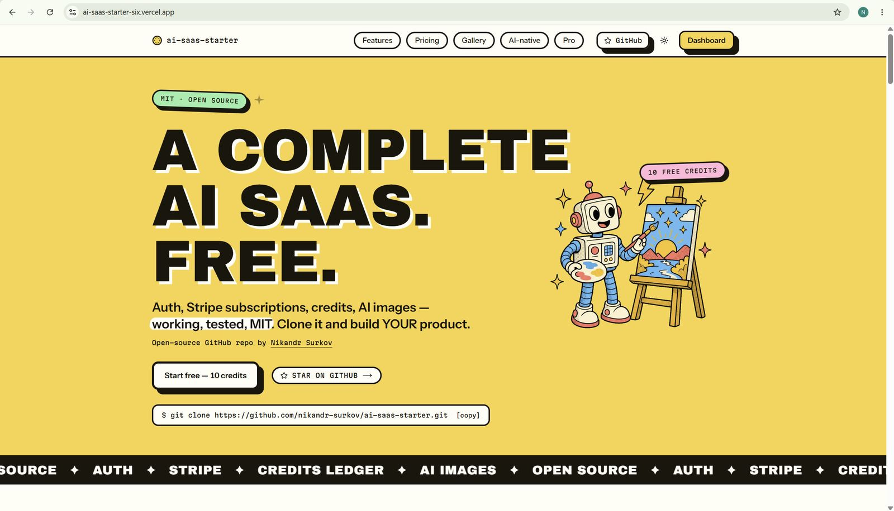
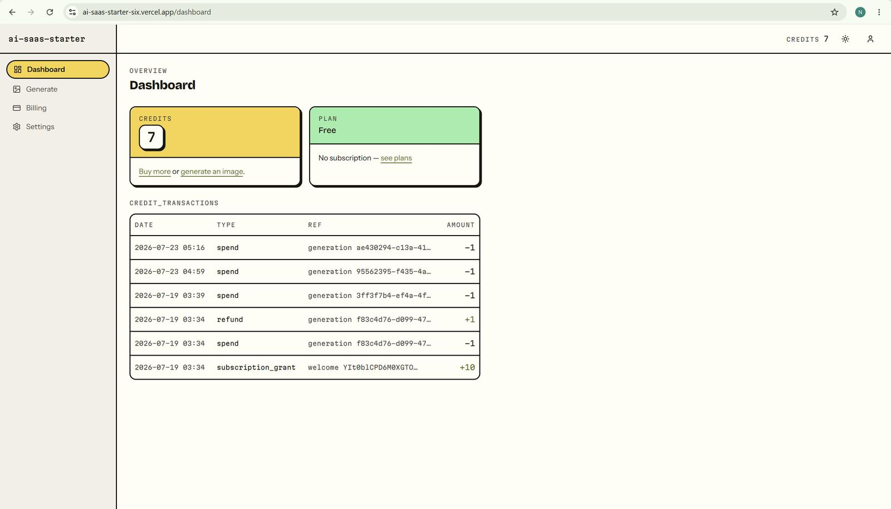
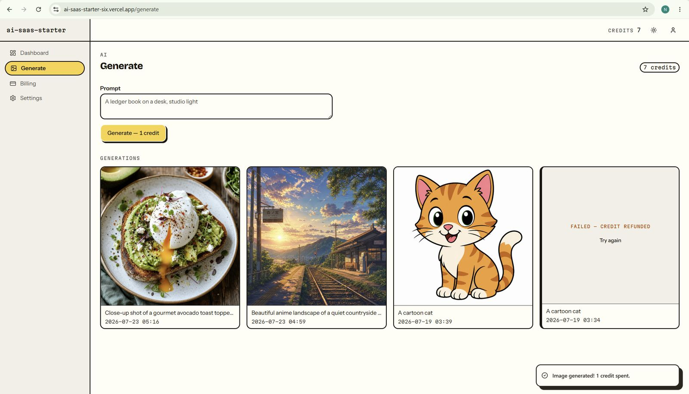
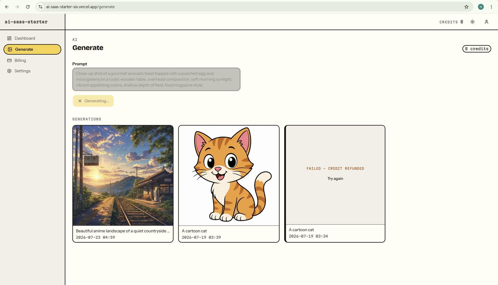
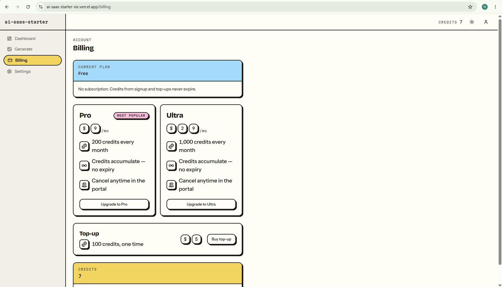
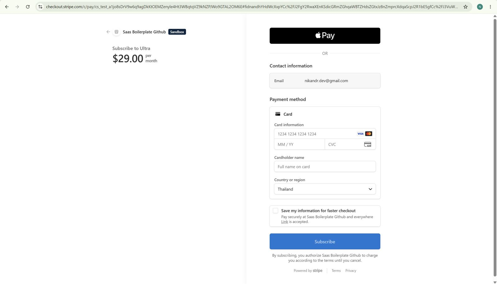
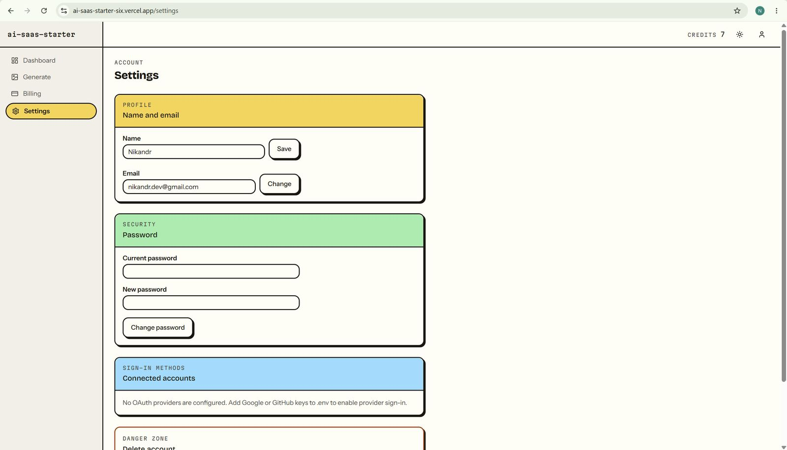
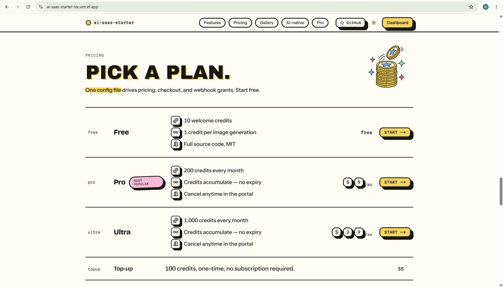

# ai-saas-starter

The free, open-source AI SaaS boilerplate and starter kit for Next.js 16.

Auth, Stripe subscriptions, an append-only credits ledger, and AI image
generation — built as an AI-native repo that Claude Code, Cursor, and
Codex can extend without breaking the money paths.

[](https://github.com/nikandr-surkov/ai-saas-starter/actions/workflows/ci.yml)
[](LICENSE)
[](https://github.com/nikandr-surkov/ai-saas-starter/stargazers)

[Live demo](https://ai-saas-starter-six.vercel.app) ·
[Deploy guide](#deploy-to-production-vercel--neon) ·
[Pro version](https://nikandr.com)



## What is this?

- **This website is the demo** — [sign up](https://ai-saas-starter-six.vercel.app),
  everything works.
- **The code is a free GitHub repo** — MIT, clone it.
- **You build YOUR product on top** — auth and payments are done.

A free, open-source SaaS boilerplate / starter kit for **Next.js 16 ·
React 19 · TypeScript strict · Better Auth · Drizzle + PostgreSQL ·
Stripe · AI SDK 6 · Tailwind v4 + shadcn/ui · Resend · Vitest +
Playwright**.

## See it

|                                                                                                                                   |                                                                                                            |
| --------------------------------------------------------------------------------------------------------------------------------- | ---------------------------------------------------------------------------------------------------------- |
|  |         |
| [Credits ledger on the dashboard — balance is SUM(amount), enforced](#whats-inside)                                               | [AI image generation — 1 credit per image](#whats-inside)                                                  |
|                        |                 |
| [Busy state](#whats-inside)                                                                                                       | [Plans from one config file](#whats-inside)                                                                |
|                                            |  |
| [Real Stripe checkout (test mode)](#stripe-locally)                                                                               | [Auth + account settings](#whats-inside)                                                                   |

## Why another SaaS boilerplate?

AI assistants are good at building product features and bad at the 20% that
loses money when improvised: webhook retries, concurrent spends, refund
paths, idempotency. This repo ships that 20% finished and tested — an
append-only credit ledger whose balance is enforced equal to
`SUM(amount)`, Stripe webhooks that verify raw-body signatures and survive
replays, a double-spend race test against real Postgres — plus the context
files (AGENTS.md, rules, skills, hooks) that keep an agent from quietly
unpicking any of it while you vibe-code the product on top.

## Quickstart (60 seconds)

```bash
git clone https://github.com/nikandr-surkov/ai-saas-starter.git my-app
cd my-app
pnpm install
docker compose up -d        # Postgres 17
cp .env.example .env        # fill in BETTER_AUTH_SECRET (openssl rand -base64 32)
pnpm db:migrate
pnpm dev
```

That boots with graceful degradation: no Stripe keys → billing page shows a
setup card; no Resend key → emails no-op with a console warning; no OAuth
keys → those buttons hide; `AI_MOCK=true` → image generation is free and
offline. Every variable is documented in [.env.example](.env.example).

## Quickstart for AI agents

Paste this into your coding agent:

```text
Clone https://github.com/nikandr-surkov/ai-saas-starter.git and get it
running: install deps, start Postgres via docker compose, create .env
from the example (generate the secret), migrate, run dev. Then read
AGENTS.md and brief me on the rules you're operating under.
```

Works with Claude Code, Cursor, Codex, Copilot, and Gemini CLI. The repo
briefs the agent itself — AGENTS.md, path-scoped rules, skills, hooks.

## What's inside

- **Auth** — email/password with verification, Google, GitHub, magic links.
  Sessions live in your Postgres. Settings page with password change,
  account linking, and cascade-safe account deletion (cancels the Stripe
  subscription first).

  

- **Billing** — Stripe Checkout + Customer Portal as server actions, a
  signature-verified webhook, and one sync function as the only writer of
  subscription state. Plans, prices, and credit amounts live in
  [src/config/plans.ts](src/config/plans.ts) and nowhere else.

  
  

- **Credits ledger** — append-only `credit_transactions` with UNIQUE
  idempotency keys. Grants on `invoice.paid` (`grant_{invoiceId}`), top-ups
  on checkout (`topup_{sessionId}`), spends as one conditional UPDATE (the
  race guard), refunds as compensating rows. The database itself refuses
  negative balances and zero-amount rows.
- **AI generation** — prompt → rate limit (10/min) → spend 1 credit →
  AI SDK 6 `generateImage` → store (Vercel Blob, or `./.generated` in dev)
  → history grid. Provider failure refunds automatically. Swap models via
  `AI_IMAGE_MODEL=provider/model`; add providers by implementing one
  interface ([src/lib/ai/provider.ts](src/lib/ai/provider.ts)).
- **Design system** — "The Ledger, LOUD MODE": tokens and hard rules in
  [DESIGN.md](DESIGN.md), light and dark, generated illustrations, an
  interaction grammar with press physics. `/styleguide` (dev only) shows
  every primitive in both themes.

## The AI-native part

This repo assumes an agent will extend it, and briefs the agent accordingly:

| File                              | What it does for the agent                                                                                                                                                   |
| --------------------------------- | ---------------------------------------------------------------------------------------------------------------------------------------------------------------------------- |
| [AGENTS.md](AGENTS.md)            | The operating manual: commands, conventions, safety boundaries (NEVER / ASK FIRST), gotchas, definition of done. Works with Claude Code, Cursor, Codex, Copilot, Gemini CLI. |
| [CLAUDE.md](CLAUDE.md)            | Imports AGENTS.md, adds plan-mode policy for money code and skill pointers.                                                                                                  |
| [DESIGN.md](DESIGN.md)            | Tokens plus hard rules, so generated UI stays on-brand.                                                                                                                      |
| `.claude/rules/`                  | Path-scoped invariants that load only when billing, database, or design files are touched.                                                                                   |
| `.claude/skills/`                 | `/add-feature`, `/add-ai-provider`, `/db-migration` — the common jobs, scripted the repo's way.                                                                              |
| `.claude/hooks/`                  | Prettier after every edit; a Stop hook that blocks "done" until `tsc --noEmit` passes.                                                                                       |
| `.claude/agents/code-reviewer.md` | A read-only reviewer for auth/billing/ledger diffs. It found real money bugs during this repo's own build.                                                                   |
| `specs/TEMPLATE.md`               | Spec-first workflow — copy it, fill it, hand it to the agent. A filled example is included.                                                                                  |

With Claude Code: open the repo and the context loads itself; type
`/add-feature` to scaffold the repo way. With Cursor: `.cursor/rules/`
mirrors the same invariants. Everything defers to AGENTS.md, so there is
one source of truth to edit. Agent-assisted contributions are welcome —
run the repo's own gates and the code-reviewer agent before opening a PR
(see [CONTRIBUTING.md](CONTRIBUTING.md)).

## Architecture in one paragraph

Server Components by default; Server Actions for mutations; API routes only
for the Stripe webhook and the Better Auth handler. Zod validates every
boundary — forms, webhook payloads, and env
([src/lib/env.ts](src/lib/env.ts), the only place `process.env` is read).
Money is integer cents, credits are integers, and two modules own the
dangerous writes: [src/lib/credits/](src/lib/credits/) is the only code
that touches credit tables, and `syncStripeDataToDb` in
[src/lib/billing/sync.ts](src/lib/billing/sync.ts) is the only writer of
subscription state — webhooks are triggers, never sources of truth.

## Testing

```bash
pnpm test        # Vitest — needs Postgres: docker compose up -d
pnpm test:e2e    # Playwright — boots its own dev server on :3100
```

94 unit/integration tests: the full ledger behavioral suite against real
Postgres (double-spend race, exact-boundary spends, idempotent replays,
refunds, key-collision detection, invariant checks, DB CHECK probes),
webhook signature verification with real HMAC fixtures, sync derivation,
plans-config locks, env validation, email rendering. 12 e2e tests: signup
to dashboard, mock generation, the FAIL-refund path, the 0-credit block,
open-redirect guards, image-route authorization, billing plan cards from
the plans config.

The spend→refund loop is user-visible, not just tested: a failed
generation refunds its credit automatically and says so on the tile.


e2e runs against `next dev` deliberately — `AI_MOCK=true` is refused in
production builds, so a build+start e2e would hit a real provider. The
comment in [playwright.config.ts](playwright.config.ts) explains.

## Stripe, locally

1. Create three test-mode prices (Pro $9/mo, Ultra $29/mo, Top-up $5
   one-time) in the [Stripe dashboard](https://dashboard.stripe.com/test/products)
   or via the API, and put the `price_...` IDs in `.env`.
2. `pnpm stripe:listen` (Stripe CLI) — copy the printed `whsec_...` into
   `.env`, restart `pnpm dev`.
3. Subscribe with card `4242 4242 4242 4242` → the webhook grants the
   plan's credits, keyed by invoice ID. Resend the event from the Stripe
   dashboard — the ledger's unique key makes the replay a no-op.
4. Renewals and cancellations can't wait a month: use
   [test clocks](https://docs.stripe.com/billing/testing/test-clocks) to
   advance time. Portal cancellations set `cancel_at` (not the legacy
   boolean) — the sync handles both; don't "simplify" it.


## Deploy to production (Vercel + Neon)

The order matters — follow it top to bottom.

1. **Neon** — create a project and copy BOTH connection strings: the
   **pooled** one (contains `-pooler`, for the running app) and the
   **direct** one (for migrations).
2. **Vercel** — import the GitHub repo. Don't deploy yet.
3. **Blob store** — in the Vercel project: Storage → Create → Blob, with
   **Access: Public**, and **tick "Add a read-write token env var"** — the
   default flow skips it and leaves `BLOB_READ_WRITE_TOKEN` unset, which
   silently sends generated images to the (nonexistent) local fallback.
4. **Environment variables** — everything from `.env.example`:

   | Variable                               | Value                                     |
   | -------------------------------------- | ----------------------------------------- |
   | `DATABASE_URL`                         | the **pooled** Neon URL (runtime traffic) |
   | `BETTER_AUTH_SECRET`                   | `openssl rand -base64 32`                 |
   | `BETTER_AUTH_URL`                      | the exact deployed URL — see step 9       |
   | `STRIPE_SECRET_KEY` + 3 price IDs      | from your Stripe dashboard                |
   | `STRIPE_WEBHOOK_SECRET`                | placeholder for now — replaced in step 7  |
   | `AI_GATEWAY_API_KEY`, `AI_IMAGE_MODEL` | AI Gateway; `AI_MOCK` stays UNSET         |
   | `RESEND_API_KEY`, `EMAIL_FROM`         | verified Resend domain                    |
   | `BLOB_READ_WRITE_TOKEN`                | added by step 3's checkbox                |

5. **Deploy** and note the real production domain Vercel assigns — it may
   suffix the project name (e.g. `-six`).
6. **Migrate once**, locally, with the **direct** URL (the pooler rejects
   some DDL): `DATABASE_URL="<direct Neon URL>" pnpm db:migrate`
7. **Stripe webhook** — create the endpoint for the REAL deployed domain:
   `https://<real-domain>/api/stripe/webhook`, events `invoice.paid`,
   `checkout.session.completed`, `customer.subscription.updated`,
   `customer.subscription.deleted` — then copy its `whsec_...` into the
   Vercel env, replacing the placeholder.
8. **Redeploy** — env changes never apply to a running deployment.
9. **Pin the domain** — set `BETTER_AUTH_URL` (env) and `siteConfig.url`
   ([src/config/site.ts](src/config/site.ts)) to the exact production URL
   from step 5, push, and redeploy if either changed.

### Common deploy errors

| Error                                              | Cause                                                                                              | Fix                                                                |
| -------------------------------------------------- | -------------------------------------------------------------------------------------------------- | ------------------------------------------------------------------ |
| `Invalid origin: ...` on signup/login              | `BETTER_AUTH_URL` doesn't match the actual domain — Vercel may have suffixed the project name      | Set the exact URL in the env, redeploy                             |
| `Free tier users do not have access to this model` | The AI Gateway key has no paid credits — the key's quota is a spending cap, not a balance          | Add credits to the gateway account, or bring your own provider key |
| Signup 500 / `relation "users" does not exist`     | Migrations never ran against the production database                                               | `DATABASE_URL="<direct Neon URL>" pnpm db:migrate`                 |
| Subscribed but no credits arrived                  | Webhook endpoint points at the wrong domain, stale `whsec_`, or the env changed without a redeploy | Recheck step 7's domain, replace the secret, redeploy              |

Every env change requires a redeploy — Vercel bakes env at build time.

## FAQ

**Is this production-ready?** The billing and ledger core is tested to a
standard most products never reach (races, replays, invariants, adversarial
webhooks). The legal pages are placeholders and the product on top is
yours to build.

**Does it work with Claude Code / Cursor?** Yes — that's the point. The
repo carries its own agent context (AGENTS.md, CLAUDE.md, path-scoped
rules, skills, hooks); Cursor reads the mirrored `.cursor/rules/`. Open
the repo and the agent is briefed.

**How does the credits system work?** Every credit movement is an
append-only row in `credit_transactions` with a unique idempotency key,
so webhook replays can't double-grant. Spends are one conditional UPDATE
that refuses to go below zero, and the cached balance is enforced equal
to `SUM(amount)` by tests and a DB CHECK.

**Can I swap gpt-image for another model?** One env string:
`AI_IMAGE_MODEL=provider/model` — no code changes.

**Why Better Auth instead of NextAuth/Clerk?** Sessions and users live in
YOUR Postgres next to the ledger, so account deletion, credit grants, and
webhooks are one transaction-safe world. No per-user vendor pricing on a
free starter.

**Is this a free alternative to ShipFast or Makerkit?** It overlaps where
every SaaS starter overlaps — auth, Stripe, landing page — but the focus
is different: a tested credits ledger, an AI generation loop, and agent
context files, free and MIT. The paid kits are broader (teams, i18n,
admin); the Pro version covers that ground.

**Why is generation mocked by default?** So a fresh clone works offline and
free. Set `AI_GATEWAY_API_KEY` and `AI_MOCK=false` for real images; in mock
mode, a prompt containing `FAIL` demos the refund path.

**Can I swap Postgres providers?** Anything with a `postgres://` URL —
Neon, Supabase, RDS, the bundled Docker.

**Where do I start extending?** Copy `specs/TEMPLATE.md`, write ten lines,
and hand it to your agent with `/add-feature`.

## Free vs Pro

| Capability                                | Free — this repo | [Pro — nikandr.com](https://nikandr.com) |
| ----------------------------------------- | ---------------- | ---------------------------------------- |
| Auth, subscriptions, credits ledger       | full             | + rollover, meters, packs                |
| AI generation                             | 1 image provider | image + video + audio, 7 providers       |
| Async job pipeline, webhooks, auto-refund | —                | Inngest, durable                         |
| Gallery + R2 storage, teams, admin        | —                | included                                 |
| MCP server + extended agent skills        | core set         | full suite                               |

The free repo is complete — nothing above is crippled. Pro is what comes
after product-market fit.

## Author

Built by **Nikandr Surkov** — [nikandr.com](https://nikandr.com). If this
repo saved you time,
[star it](https://github.com/nikandr-surkov/ai-saas-starter/stargazers) —
stars are how other builders find it.

## License

MIT — see [LICENSE](LICENSE).
